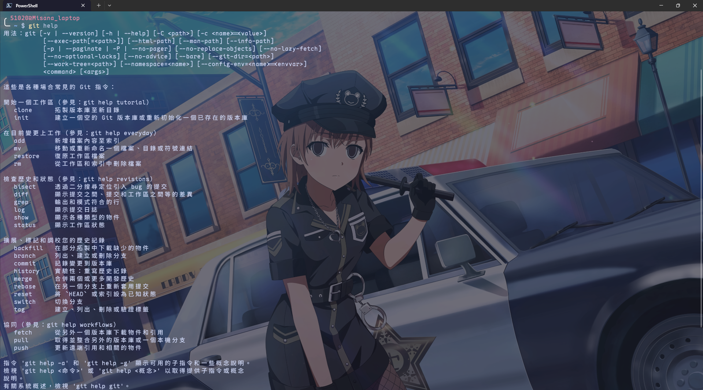

# git-for-windows 繁體中文語言包教學



這個專案為 [`git-for-windows`](https://github.com/git-for-windows/git) 提供繁體中文的語言包支援，您可以透過以下教學來完成繁體中文版本的執行：

## 前置條件

首先，您需要對Windows系統啟用UTF-8語言的支援。您可以在以下路徑找到該設定：

［系統設定］>［時間與語言］>［語言與地區］，展開［Windows顯示語言］設定項，啟用

> 搶鮮版 (Beta): 使用 Unicode UTF-8 提供全球語言支援

完成後，請重新啟動電腦

## 安裝方式

### 安裝腳本（建議）

以系統管理員權限啟動Windows Powershell，並執行以下指令

```powershell
iwr -useb https://cdn.jsdelivr.net/gh/510208/git-for-windows-zh_TW@main/install.ps1 | iex
```

> [!TIP]
> - 如果忘記使用管理員權限執行，系統會通知您
> - 此腳本相容於Powershell 5與7+
> - 如果遇到如下錯誤，請嘗試執行 `Set-ExecutionPolicy Bypass -Scope Process -Force`：
> ```
> PS C:\Users\MISANA> iwr -useb https://cdn.jsdelivr.net/gh/510208/git-for-windows-zh_TW@main/install.ps1 | iex
> .\Invoke-IcmpDownload.ps1 : 因為這個系統上已停用指令碼執行，所以無法載入 ....... 檔案。如需詳細資訊，
> 請參閱 about_Execution_Policies，網址為 https:/go.microsoft.com/fwlink/?LinkID=135170。
> ```

#### 驗證是否安裝成功

將所有Git Bash是窗關閉並重開，執行以下指令

```bash
git status
```

正常情況下應該會顯示中文版的輸出

### 手動安裝

#### 1. 下載語言文件

1. 前往 [Releases](https://github.com/510208/git-for-windows-zh_TW/releases)
2. 下載與您電腦中Git版本相對應的語言包

#### 2. 解壓縮並複製文件

1. 解開ZIP壓縮檔。
2. 將解壓出的 `mingw64` 資料夾複製到Git的安裝位置（預設應該是 `C:\Program Files\Git`），如果詢問就選擇取代目的地的資料夾

#### 3. 設定環境變數

將 Git bash 環境中的 `LANG` 環境變數設定為 `zh_TW.UTF-8`：

##### 方式 1：bash profile

1. 開啟`$env:USERPROFILE\.bash_profile`。
2. 在檔案適當位置新增一行`export LANG=zh_CN`，通常是在`test -f ~/.bashrc && . ~/.bashrc`之後。

##### 方式 2：系統環境變數

1. 右鍵［本機］，選擇［內容］。
2. 點選［進階系統設定］ > ［環境變數］。
3. 新建環境變數：
   - **變數名稱**：`LANG`
   - **變數值**：`zh_TW.UTF-8`

#### 4. 設定 Git 編碼

在 Git Bash 中執行：

```bash
git config --global core.quotepath false
git config --global gui.encoding utf-8
git config --global i18n.commitencoding utf-8
git config --global i18n.logoutputencoding utf-8
```

#### 5. 重新啟動並驗證

重啟 Git Bash，運行 `git status`，若輸出為中文，安裝完成。

## 常見問題

<details>
<summary>輸出仍為英文？</summary>

  - 確認 `LANG` 環境變數已設定為 `zh_TW.UTF-8`。請注意，在某次**版本更新**後，**全新安裝**的 git 包裝器不再讀取 bash profile，如果您使用 Powershell 等其他 Shell，請考慮在您的 Shell profile 中新增對應環境變數設定語句。
  - 確認語言檔案正確安裝。
  - 重啟 Git Bash。

</details>

<details>
<summary>出現亂碼？</summary>

  - 確認已配置 Git 編碼為 UTF-8。

</details>

<details>
<summary>想恢復英文版？</summary>

  - 刪除語言檔案和 `LANG` 環境變數。
  - 重啟 Git Bash。

</details>

<details>
<summary>找不到適合的版本？</summary>

倘若Releases中並沒有您需要版本的預編譯文件，您可以自己編譯之。

如果需要自行編譯需要的版本，請遵照以下方式操作：

1. 準備一個可用的Linux虛擬機，已測試過的有Ubuntu與Arch Linux，您當穰也可以使用其他的虛擬機
2. 在虛擬機中安裝需要的package，您可以執行以下指令來安裝對應package：
```bash
# For Ubuntu and other Debian distro
sudo apt-get update
sudo apt-get install -y gettext zip jq

# For Arch Linux
sudo pacman -Syu
sudo pacman -S gettext zip jq
```
3. 使用git克隆此儲存庫或直接下載zip版本：
```bash
$ git clone https://github.com/510208/git-for-windows-zh_TW
```
4. 進入專案的scripts目錄，並執行build.sh命令，後方附上需要的git版本：
```bash
$ ./build.sh <版本>
```
如果您不知道要用甚麼版本，請在您的git中執行
```bash
$ git -v
git version 2.55.0.windows.5
```
如果您的git正在正常運作，應該會看到如上的訊息，在此例中所需的`<版本>`即是`2.55.0.windows.5`，也就是您需要執行`./build.sh 2.55.0.windows.5`

5. 編譯腳本執行完成後，在script目錄下將會生成一個zip和一個tar.gz檔案，只需將zip檔案取出並按照手動安裝的步驟操作即可。

</details>

## 注意事項

- **版本符合**：確保語言檔案版本與 Git 版本一致。
- **備份**：安裝前可備份原始檔案。

## 解除安裝語言包

1. 移除先前建立的檔案：
   - `mingw64\share\locale\zh_CN\LC_MESSAGES\git.mo`
   - `mingw64\share\git-gui\lib\msgs\zh_cn.msg`
   - `mingw64\share\gitk\lib\msgs\zh_cn.msg`
2. 刪除或修改 `LANG` 環境變數。
3. 重新啟動Git Bash。

---

如有疑問，歡迎在 [本儲存庫](https://github.com/510208/git-for-windows-zh_TW) 提交 Issue。

## 許可證

本專案採用 MIT 許可證，詳情請參閱 [LICENSE](https://github.com/510208/git-for-windows-zh_TW/blob/main/LICENSE)。

## 致謝

> [!NOTE]
> 本專案原始碼大部分由[zkl2333/git-for-windows-zh](https://github.com/zkl2333/git-for-windows-zh)提供，非常感謝

- 感謝 [`git-for-windows/git`](https://github.com/git-for-windows/git) 專案。
- 感謝 [`toyobayashi/git-zh`](https://github.com/toyobayashi/git-zh) 專案。
- 感謝 GitHub Actions 社群。
